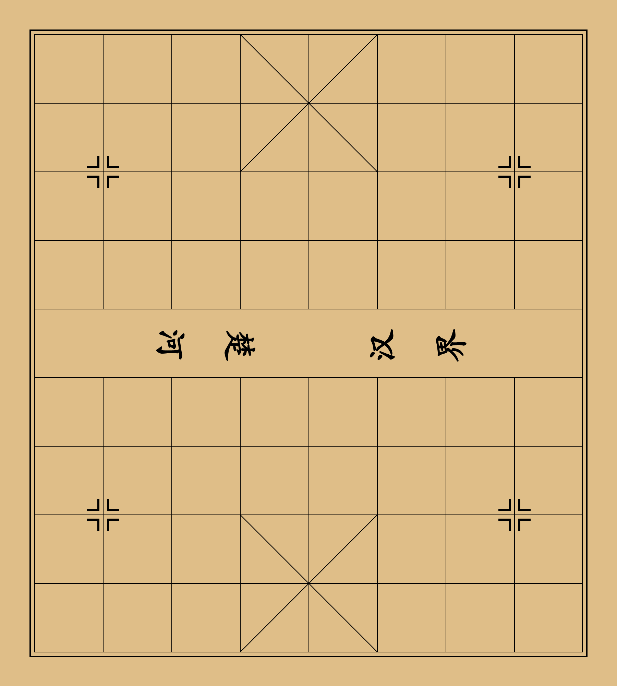

# chinese-cheese
中国象棋

## 效果
全部效果:  
  
棋子效果(黑):  
  
棋子效果(红):  
  
添加楚河、汉界:  
    
This project was bootstrapped with [Create React App](https://github.com/facebook/create-react-app).   

## 后续设计
1、 运行后，本地后打开网页，展示棋盘，可以开始下棋  
2、 用户可以选择本地模式和联机模式  
3、 本地模式自己和自己下棋  
4、 联机模式，自己和别人通过局域网下棋  

## Notice  
1、 build里为打包产物  