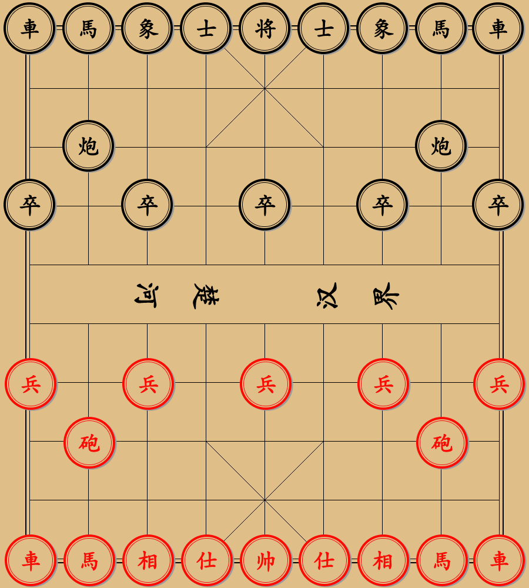

# chinese-cheese
中国象棋，

## 效果&&使用
  
如仅需在线看最终效果，可点击下面连接  
[点我下棋👉🏻](https://weisiwu.github.io/chinese-cheese/build/)  
如希望下载后在本地运行、改造，则按照下面进行操作:  
``` javascript 
npm install
npm run start
```
后续代码任意改造。  

## 依赖
1、 状态管理/数据流: redux/@reduxjs/toolkit  
2、 前端脚手架: create-react-app  
3、 拖拽功能: react-dnd  
4、 截图功能: dom-to-image  

## 后续设计
### 待修复问题
1、 棋子移动的preview是倾斜的，改成端正的  
2、 棋子可拖拽区域变大  

### 待添加功能
1、 可导出对局过程    
2、 添加对联机的支持  
3、 对局状态，可左右拖拽  

## Notice  
1、 build里为打包产物  

> This project was bootstrapped with [Create React App](https://github.com/facebook/create-react-app).   